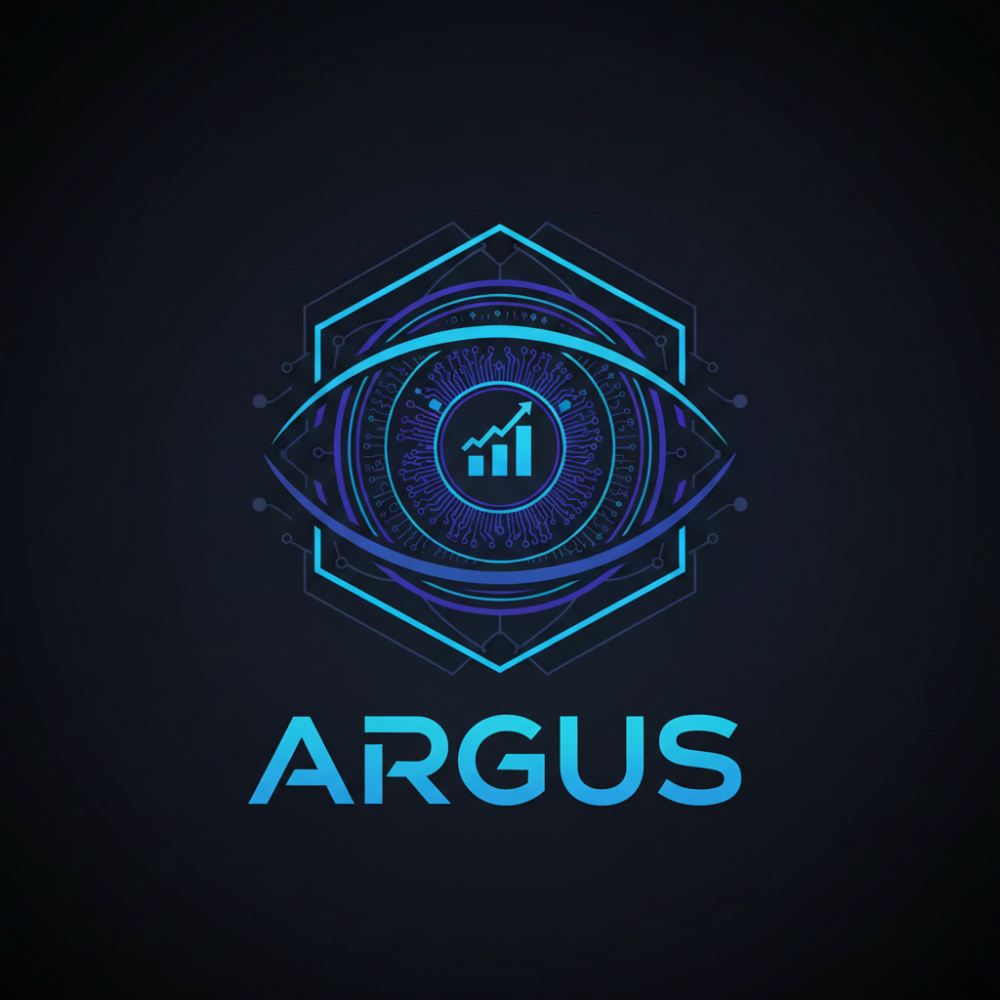
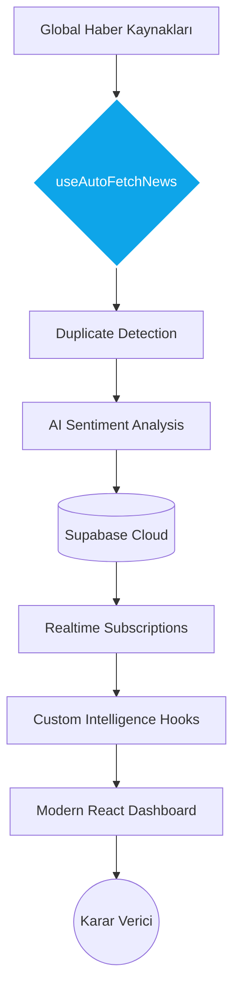

<div align="center">
  

  # <span style="font-family: 'JetBrains Mono', monospace; font-weight: 800; letter-spacing: -1px; color: #0ea5e9;">A R G U S</span>
  ### <span style="color: #64748b; font-weight: 400;">Global Intelligence • Signal Analysis • Strategic AI Engine</span>

  **Kesintisiz Veri Akışı** • **Otonom Duygu Analizi** • **Prediktif Karar Destek**

  [🌐 Canlı Demo](https://your-demo-link.com) • [📖 Dokümantasyon](#) • [💬 LinkedIn](https://www.linkedin.com/in/omerabali)

  
  
  
  
  

  <br/>
  <p align="center">
    <b>"Gürültüden Sinyali Ayıklayın."</b><br/>
    Konvansiyonel haber akışını fütüristik bir istihbarat merkezine dönüştüren, yüksek performanslı sinyal analiz platformu.
  </p>
</div>

---

## 🎯 ARGUS Nedir? (The Vision)

**ARGUS**, modern bilgi çağının en temel paradoksu olan "bilgi asimetrisi" ve "bilgi kirliliğini" çözmek amacıyla tasarlanmış, uçtan uca otonom bir istihbarat ekosistemidir. Basit bir haber toplayıcıdan (aggregator) öte; veriyi otonom olarak işleyen, önceliklendiren ve kullanıcıya stratejik bir "görüş netliği" sunan bir karar destek mekanizmasıdır.

### Temel Değer Önerileri (Core Value Props)

1.  **Autonomous Pipeline**: 7/24 kesintisiz veri madenciliği yapan ve sinyalleri standart YAML/JSON formatlarına normalize eden merkezi motor.
2.  **Intelligence & Sentiment**: Haberleri sadece listelemez; NLP tabanlı duygu analizi ile (Nötr/Pozitif/Negatif) kategorize eder ve meta-veriler ekler.
3.  **Behavioral Personalization**: Kullanıcının okuma alışkanlıklarını (Reading Time, Category Frequency) analiz eden ve ağırlıklı skorlama ile kişisel öneriler sunan engine.
4.  **Offline-First Infrastructure**: İnternet bağlantısı kesildiğinde dahi kesintisiz erişim sağlayan LocalStorage tabanlı persistency katmanı.

---

## 🏗️ Mimari ve Teknik Altyapı (Architecture & Tech Stack)

ARGUS, yüksek ölçeklenebilir ve modüler bir mikro-mimari üzerine inşa edilmiştir.

### Teknik Katmanlar
- **Data Orchestration layer**: TanStack Query (v5) kullanılarak asenkron veri akışı, global önbellek yönetimi ve iyimser güncellemeler (optimistic updates) optimize edilmiştir.
- **AI Intelligence Layer**: Supabase Edge Functions üzerinde çalışan sentiment analiz motoru ve otonom etiketleme (auto-tagging) sistemi.
- **Identity & Security**: Supabase Auth tabanlı, JWT bazlı yetkilendirme ve veritabanı seviyesinde Row Level Security (RLS) politikaları.



---

## 🚀 Gelişmiş Özellikler (Advanced Features)

### 🧠 Akıllı Öneri Motoru (Recommendation Engine)
`useNewsRecommendations` hook'u altında çalışan sistem, kullanıcının okuma geçmişini analiz eder:
- **Ağırlıklı Skorlama:** Kategori ve kelime eşleşmeleri, okuma süresine göre ağırlıklandırılır.
- **Resan (Recency) Boost:** Güncel haberlere dinamik olarak %20-%50 arası puan artışı uygulanır.
- **Duygu Filtreleme:** Kullanıcının tercih ettiği duygu tonuna göre (örn. ağırlıklı pozitif haberler) içerik seçimi.

### ⚡ Kesintisiz Veri ve Offline Desteği
- **Auto-Sync:** Belirlenen interval aralıklarıyla (varsayılan 2 dk) durmaksızın veri yenileme.
- **Offline Persistence:** `useOfflineNews` ile haberlerin yerel depolanması ve bağlantı durumuna göre dinamik toast bildirimleri.
- **Network State Handling:** `navigator.onLine` API entegrasyonu ile otomatik mod değişimi.

### 📊 Karşılaştırma ve Trend Analizi
- **Signal Comparison:** Benzer haberleri anahtar kelime ve kategori benzerlik skoruyla (Similarity Scoring) gruplandırma.
- **Trend Projeksiyonu:** Son 24 saatlik veriler üzerinden yükselen anahtar kelimelerin frekans analizi.

---

## 🛠️ Teknik Envanter (Inventory)

| Bileşen | Teknoloji | Mimari Karar Nedeni |
|:---|:---|:---|
| **Platform** | React 18 + Vite | Modern, tree-shaking destekli ve hızlı HMR sunan altyapı. |
| **Logic** | Custom TypeScript Hooks | Karmaşıklığın arayüzden soyutlanması ve test edilebilir logic. |
| **Backend** | Supabase (PostgreSQL) | Real-time yetenekler ve dahili Auth/Edge Functions desteği. |
| **Styling** | Shadcn UI + Tailwind | Erişilebilirlik (A11y) standartlarına uygun, modüler UI. |
| **Analysis** | Gemini/NLP compatible API | Sinyal analizi ve duygu sınıflandırması için AI entegrasyonu. |

---

## ⚙️ Kurulum ve Geliştirme (Setup)

```bash
# 1. Pipeline'ı Klonlayın
git clone https://github.com/yourusername/argus.git

# 2. Bağımlılıkları Normalize Edin
cd argus && npm install

# 3. Ortam Değişkenlerini Tanımlayın (.env)
VITE_SUPABASE_URL=your_url
VITE_SUPABASE_ANON_KEY=your_key

# 4. Geliştirici Sunucusunu Başlatın
npm run dev
```

---

## 👤 Geliştirici (Author)

**Ömer Abalı**

Yapay zeka odaklı uygulamalar, veri boru hatları (data pipelines) ve modern web mimarileri üzerine uzmanlaşmış bir geliştirici.

- 💼 LinkedIn: [linkedin.com/in/omerabali](https://linkedin.com/in/omerabali)
- 🖥️ GitHub: [github.com/omerabali](https://github.com/omerabali)

---

<div align="center">
  <br/>
  <a href="https://www.linkedin.com/in/omerabali" target="_blank">
    
  </a>
  <br/><br/>
  <strong>ARGUS | Her Şeyi Gör. Sinyali Yakala.</strong><br/>
  <br/>
  Made with ❤️ for high-performance intelligence mapping.
</div>
